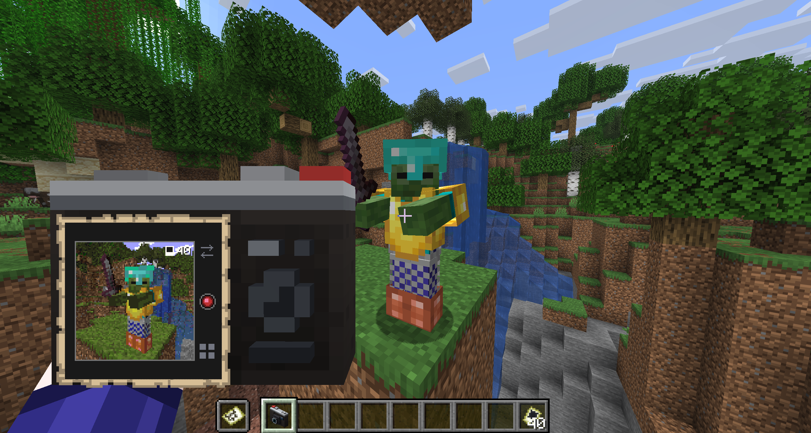
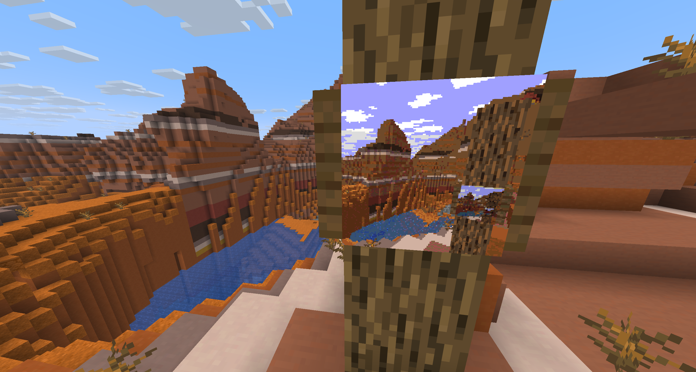
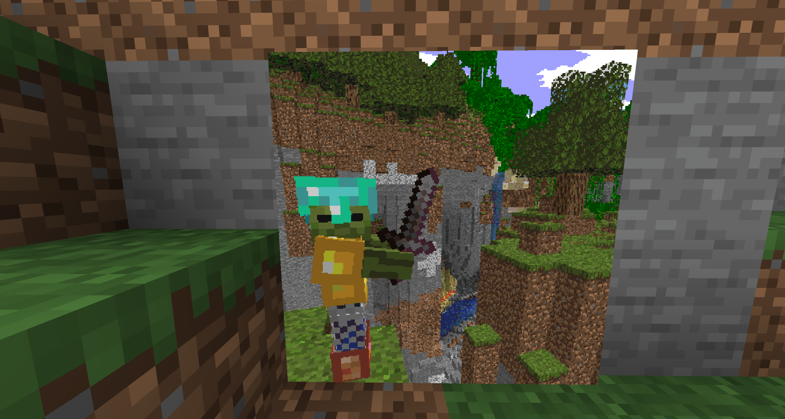

# MapCamera

A minecraft plugin for realistic cameras.
100% serverside rendering via raycasting, no mods required.
Hold the camera item in your hand and a viewfinder appears showing you live what the camera can see.
Press the photo key and receive a real 128x128 map image, which you can hang in an item frame or share with others.
The raycaster can render every block, tile-entity and entity.



## Features

- **A live viewfinder.** The map in your offhand shows the world in front of you, updating as you look around. What you line up is what you get.
- **Photographs are real vanilla maps.** The picture is stored as a real locked map, so it survives restarts and even survives this plugin being uninstalled.
- **Zoom** Zoom in and out with sneak + scroll.
- **Selfie mode.** Turn the lens around and take a selfie.
- **2x2 shots.** An extra mode to take 256x256 images instead of single-map 128x128s. Returns four maps which you can arrange on itemframes in a 2x2.
- **3D cameras** Realistic 3D camera models from a resource pack that ships inside the jar. Can be turned off. Without it the items fall back to fitting vanilla models.
- **Everything is configurable:** recipes, items, costs, cooldowns, sounds, and every line of text a player reads.





## Requirements

|        |                                                                                                     |
| ------ | --------------------------------------------------------------------------------------------------- |
| Server | Paper 26.2 or newer                                                                                 |
| Java   | 25                                                                                                  |
| Plugin | [MapGUI](https://github.com/FloG99/MapGUI) **1.1.1 or newer**, which does the rendering and drawing |

## Installation

Two jars, both straight into `plugins/`.

1. Download **[MapGUI](https://github.com/FloG99/MapGUI/releases)** (1.1.1 or newer) and drop it into `plugins/`.
2. Download **MapCamera** and drop it in beside it.
3. Start the server.

The first capture downloads Minecraft's block textures from Mojang, once.

## Controls

|                              |                            |
| ---------------------------- | -------------------------- |
| **F** (swap hands)           | take a photo               |
| **Sneak**                    | show the cursor            |
| **Sneak + move mouse**       | move the cursor            |
| **Sneak + scroll**           | zoom                       |
| **Sneak + click the arrows** | turn the lens around       |
| **Sneak + click the grid**   | switch between 1x1 and 2x2 |
| **Scroll to another item**   | put the camera away        |

The shutter is a key rather than a button on the map, because the cursor moves with your head and reaching for a button would turn the camera at it.
`viewfinder.shutter` changes it to left or right click.

While the viewfinder is up you cannot mine or place blocks. Scroll to another item and it is gone.

## Commands

All of these need `mapcamera.admin`.

| Command                                       |                                                                      |
| --------------------------------------------- | -------------------------------------------------------------------- |
| `/mapcamera give <camera> [players] [amount]` | one branch per camera you have enabled                               |
| `/mapcamera give film [players] [amount]`     |                                                                      |
| `/mapcamera reload`                           | re-read `config.yml`                                                 |
| `/mapcamera debug`                            | frame rate, what is limiting it, and what a capture costs the server |

## Permissions

| Node              | Default   |                                             |
| ----------------- | --------- | ------------------------------------------- |
| `mapcamera.use`   | everyone  | opens the viewfinder while holding a camera |
| `mapcamera.admin` | operators | the commands above                          |

## Configuration

`config.yml` is in eight blocks, and `/mapcamera reload` picks up changes.

| Block           |                                                               |
| --------------- | ------------------------------------------------------------- |
| `resource-pack` | where the pack is hosted, or whether to host it here          |
| `photo`         | what a photograph costs and what it is                        |
| `cameras`       | one block per camera: look, recipe, design, and its own costs |
| `film`          | the film item                                                 |
| `viewfinder`    | preview size, shutter key, field of view, zoom steps          |
| `recipes`       | recipe book discovery, and the film recipe                    |
| `sounds`        | the shutter and the print                                     |
| `messages`      | every line a player reads                                     |

### A Polaroid camera, if you want one

There is an Polaroid camera design in `config.yml`, turned off by default, but you can turn it on additionally or as an alternative.
It has its own configurable recipe and settings. Set `enabled: true` under `cameras.polaroid` to enable it.


Credit for the idea + model: SuperNova258

## The resource pack

The pack gives the camera its 3D model and the film its own texture.
It is optional and it is **inside the jar**. Minecraft only accepts a pack from a URL, so you pick one of two ways to serve it:

**Host it yourself**, which is the only option on shared hosting.
A copy is written to `plugins/MapCamera/resourcepack.zip` on every start; upload it and name the link:

```yaml
resource-pack:
  url: "https://cdn.example.com/mapcamera.zip"
```

Re-upload when an update changes the pack, which most updates will not do.
Startup says so in the console when it has, and warns if the copy at your link has fallen behind.

**Or let the plugin host it**, if you control the ports:

```yaml
resource-pack:
  serve: true
  port: 8321
  address: "your.server.address" # what the CLIENT connects to, not localhost
```

**Without a pack**, the camera falls back to a player head and the film to a sheet of paper, so nothing looks too broken.

Film texture and polaroid camera texture by SuperNova258.

## Building

`./gradlew build` puts the jar in `build/libs/` and the resource pack zip in `build/distributions/`.

## License

LGPL-3.0-or-later. See [`LICENSE`](LICENSE).
